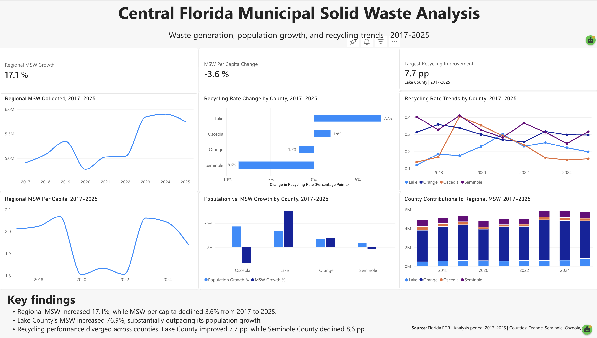

# Central Florida Municipal Solid Waste Analysis

**SQL | Power BI | Data Analysis**

## Overview

This project analyzes municipal solid waste (MSW) generation and recycling performance across four Central Florida counties — Orange, Seminole, Osceola, and Lake — from 2017 to 2025.

The goal was to determine how waste generation changed over time, whether changes in waste generation were proportional to population growth, and which counties experienced the greatest changes in recycling performance.

## Business Question

**How has municipal solid waste generation changed across Central Florida, and to what extent can changes be explained by population growth?**

## Data

- **Geography:** Orange, Seminole, Osceola, and Lake Counties, Florida
- **Period:** 2017–2025
- **Primary source:** Florida Economic and Demographic Research (EDR)
- **Metrics:** MSW collected, MSW landfilled, MSW recycled, MSW per capita, recycling rate, population, and year-over-year growth

## Tools

- **SQL:** Data cleaning, aggregation, calculations, and comparative analysis
- **Power BI:** Data visualization and dashboard development
- **Excel:** Data preparation and organization

## Analytical Approach

1. Cleaned and structured county-level MSW and population data.
2. Calculated changes in waste generation and waste per capita.
3. Compared MSW growth with population growth.
4. Analyzed county-level recycling-rate changes between 2017 and 2025.
5. Examined annual recycling and MSW-per-capita patterns from 2017–2025.
6. Built an interactive Power BI dashboard to communicate the results.

## Key Findings

### 1. Regional waste increased while waste per capita declined

Regional MSW increased approximately **17.1%** between 2017 and 2025, while MSW per capita decreased approximately **3.6%**.

### 2. Lake County experienced the largest increase in MSW

Lake County's MSW increased approximately **76.9%** between 2017 and 2025, substantially outpacing its population growth.

### 3. Recycling performance diverged across counties

Lake County's recycling rate improved by **7.7 percentage points**, while Seminole County's recycling rate declined by **8.6 percentage points**.

## Business Implications

The results suggest that population growth alone does not explain changes in waste generation across Central Florida. Large differences between counties indicate that other factors — including economic activity, tourism, consumption patterns, and waste-management practices — may influence waste generation and recycling performance.

## Dashboard

The completed Power BI dashboard is also available as a PDF in this repository.
